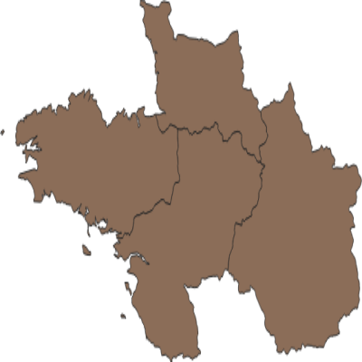

# Sandbox : manage layers

Layers are based on the `data.gpkg` file mounted in the Docker containers.


### Add layers

To add a polygon layer to a project:

```` shell
$ curl "http://localhost:5000/api/projects/my_project/layers?schema=my_schema" \
  -X POST \
  -H 'Content-Type: application/json' \
  -d '{
    "crs": 4326,
    "datasource":"/data.gpkg|layername=polygons",
    "name":"polygons",
    "type":"vector"
  }'
true
````

And a line layer:

```` shell
$ curl "http://localhost:5000/api/projects/my_project/layers?schema=my_schema" \
  -X POST \
  -H 'Content-Type: application/json' \
  -d '{
    "crs": 4326,
    "datasource":"/data.gpkg|layername=lines",
    "name":"lines",
    "type":"vector"
  }'
true
````

### List layers and get metadata

```` shell
$ curl "http://localhost:5000/api/projects/my_project/layers?schema=my_schema"
["lines","polygons"]

$ curl "http://localhost:5000/api/projects/my_project/layers/lines?schema=my_schema" | jq
{
  "bbox": "-117.62319839219100004 23.20820580488510032, -82.32264950769270229 46.18290982947510059",
  "crs": "EPSG:4326",
  "current_style": "default",
  "geometry": "MultiLineString",
  "name": "lines",
  "source": "/data.gpkg|layername=lines",
  "styles": [
    "default"
  ],
  "type": "vector",
  "valid": true
}
````


### Map sample

To execute a WMS `GetMap` request with basic parameters:

```` shell
$ curl "http://localhost:5000/api/projects/my_project/layers/polygons/map?schema=my_schema" --output map.png
````




### Delete layers

```` shell
$ curl -X DELETE "http://localhost:5000/api/projects/my_project/layers/lines?schema=my_schema"
true

$ curl "http://localhost:5000/api/projects/my_project/layers?schema=my_schema"
["polygons"]
````
