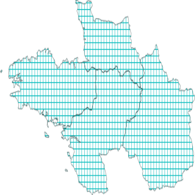

# Sandbox : manage styles


### Add style to project

To list available properties for the polygon single symbol renderer:

```` shell
$ curl "http://localhost:5000/api/symbology/vector/polygon/single_symbol/fill/properties" | jq
{
  "border_width_map_unit_scale": "3x:0,0,0,0,0,0",
  "color": "0,0,255,255",
  "joinstyle": "bevel",
  "offset": "0,0",
  "offset_map_unit_scale": "3x:0,0,0,0,0,0",
  "offset_unit": "MM",
  "outline_color": "35,35,35,255",
  "outline_style": "solid (no, solid, dash, dot, dash dot, dash dot dot)",
  "outline_width": "0.26",
  "outline_width_unit": "MM",
  "style": "solid"
}
````

To add a style for a polygon layer:

```` shell
$ curl "http://localhost:5000/api/projects/my_project/styles?schema=my_schema" \
  -X POST \
  -H 'Content-Type: application/json' \
  -d '{
    "symbol": "fill",
    "symbology": "single_symbol",
    "name": "my_fill_style",
    "properties": {
        "color": "#00BBBB",
        "style": "cross",
        "outline_width": 0.16,
        "outline_color": "#002222"
    }
  }'
true
````

To list styles for a specific project:

```` shell
$ curl "http://localhost:5000/api/projects/my_project/styles?schema=my_schema"
["my_fill_style"]
````


### Apply style to layer

To apply a specific style to a layer:

```` shell
$ curl "http://localhost:5000/api/projects/my_project/layers/polygons/style?schema=my_schema" \
  -X POST \
  -H 'Content-Type: application/json' \
  -d '{
    "name":"my_fill_style",
    "current":true
  }'
true
````

The layer rendering has changed now:

```` shell
$ curl "http://localhost:5000/api/projects/my_project/layers/polygons/map?schema=my_schema" --output map.png
````


